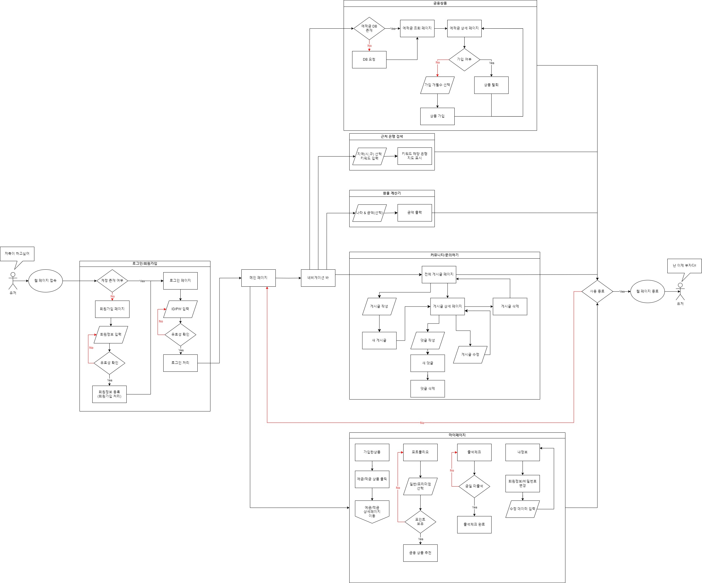

# PROFIN

삼성 청년 소프트웨어
PROFIN 금융 프로젝트
PROFIN 이란?
- PROFIT + FIN = PROFIN 이득보는 재태크 앱
------------------------------------------------

# 프로젝트 개요
#### 프로젝트 이름: PROFIN
#### 프로젝트 기간: 2024.05.08 ~ 2024.05.23
#### 구성원: 정진우, 정유진

#### 역할 분담
 - 정진우 : 메인 백엔드 개발, 프론트엔드 ~ 백엔드 사이 연결 로직 작성
 - 정유진 : 메인 프론트엔드 개발, 전체적인 디자인 담당

### 구상
- 최초 구상

    .png>)

- 최종 완성도

    

- 추가 구현이 필요한 사항
    1. 아이디 비밀번호 찾기(초기화)
    2. 회원 탈퇴
    3. 회원가입시 전화번호/이메일 인증
    4. 게시판,댓글 좋아요 기능, 댓글 수정기능
    5. 유저 프로필 업데이트

### 사용한 외부 API
1. 예금,적금 데이터 API

        - https://finlife.fss.or.kr/finlife/main/contents.do?menuNo=700029
        - 금융감독원 홈페이지
        
        - 예/적금 상품 상세조회

2. 환율 계산기
        
        - https://www.koreaexim.go.kr/ir/HPHKIR020M01?apino=2&viewtype=C&searchselect=&searchword
        - 한국 수출입은행 홈페이지
        - 환율정보 받아오기

3. 근처 은행 검색
        
        - https://apis.map.kakao.com/
        - 카카오맵 API
        - 백엔드 : REST API 활용 검색 키워드에 따른 좌표 데이터 수집
        - 프론트엔드 : 받은 좌표 정보를 지도 화면에 렌더링

### ERD(DB 관계도)

### 계획(일자)

I. 팀원 정보 및 업무 분담 내역 
II. 설계 내용(아키텍처 등) 및 실제 구현 정도 
III. 데이터베이스 모델링(ERD) 
IV. 금융 상품 추천 알고리즘에 대한 기술적 설명 
V. 서비스 대표 기능들에 대한 설명 
VI. 기타(느낀 점, 후기 등) 

## 개요

## 서비스 소개

## 서비스 화면

## 주요 기능

## 알고리즘

 - 일반 알고리즘

 - 프리미엄 알고리즘
    request.user.goal : 안전형 or 수익형 or 무계획(안전형과 수익형의 평균, 인원수의 가중치를 더 많이 받음)
    request.user.age : 현재 나이, 비슷한 나이대 인원
    item => saving/deposit_items 의 for문으로 돈 요소 (option/product)

    option
    item.intr_rate : 최소 이자율 (float)
    item.intr_rate2 : 최대 이자율 (float)
    item.intr_rate_type_nm : 단리 복리
    item.save_trm : 가입 기간
    item.product => product

    product
    item.id => 아이디
    item.buy_user.count() => 가입한 모든 유저 수
    item.kor_co_nm => 은행명
    item.fin_prdt_nm => 상품명
    item.max_limit => 한도

    단기 장기 기준 : 6개월까지는 단기
    옵션으로 추천해줌
    비율 설정 요약
    - 안전형: 중기(단기) 선호, 최소 이자율 중시, 변동성 낮음
    - 단기/장기: 0.6/0.4
    - 이자율(최소): 0.5 * 이자율
    - 변동성: 0.2 * 변동성 점수=   1/ (1+(최대 이자율−최소 이자율)) (차이 없으면 1, 변동성 낮음,  차이있으면 점점 변동성이 커짐,추천도 낮아짐)
                            

    - 수익형: 장기 선호, 최대 이자율 중시, 자유 적립식 선호, 복리 선호
    - 단기/장기: 0.4/0.6
    - 이자율(최대): 0.4 (전체적으로 최대 이자율 높음)
    - 자유 적립식/정액 적립식(or 예금): 0.3/0.2
    - 단리/복리: 0.2/0.3

    - 무계획 : 안전형과 수익형의 평균, 인원수의 가중치를 더 많이 받음 ( 안전형의 영향을 더 많이 받게 설정)

    - 가입한 인원수에 대한 가중치 

    - 안전형/수익형 

## 작업 진행상황
- 05/08 
    - 기본계획 작성
    - 구현 필요한 내용 정리(필요 API 및 필수 구현 내용)
    - ERD에 들어가야 할 내용 간단 정리

- 05/09 
    - ERD/기본 웹 틀(UI/UX)
    - ERD - erdcloud 사용
    - 어플리케이션 기본 틀 제작(UI/UX) - oven 사용
    - 기존 구상 현황 명시적으로 변경할 것(플로우차트/스토리보드 활용)
    - 로고 제작

- 05/12
    - gitignore, requirements 작성 및 CORS에러 방지 corsheader 작성
    - 유저 정보 및 수정 페이지 ERD에 맞춰서 정정
    - 비밀번호 변경 페이지 작성
    - 근처 은행 검색 페이지 작성

- 05/13
    - 플로우 차트 
        - 메인 페이지 -> 커뮤니티 작성
        - 메인 페이지 -> 환율 계산기 작성
    - 카카오 오븐
        - 이용자 서비스 ->환율 계산기 페이지 작성

- 5/14
    - 게시판 CRUD 기능 구현
    - 환율 계산기를 위한 API사용 구현
    - vue 기본 프로젝트 생성
    
- 05/16
    - 예금 정보 API 활용 데이터 저장 및 조회기능 구현
    - 회원가입, 로그인 기능 구현
    - 이슈 : 로그인 여부가 새로고침 할 때 사라짐(Token값)
    - 메인, 커뮤니티 등 기본 페이지 구현

- 05/17
    - (이슈 해결) JWT 토큰 사용하여 로그인 유지 기능 구현
    - 게시글 상세 페이지(삭제/수정/뒤로가기, 댓글 생성/삭제) 구현
    - 지도 입력 View 및 주변은행 출력 API 구현
    - 카카오 맵 API 기본 출력 구현

- 05/19
    - 카카오맵 API로 지도 구현
    - 로그인/회원가입/로그아웃 로직 구현
    - Carousel(이하 회전목마) 구현
    - 프로필, 환율 페이지 구현
    - 메인 페이지, 카카오맵, 게시판, 유저 기본 css 

- 05/20
    - 메인페이지/유저정보/로그인/회원가입/환율 계산기 css 추가
    - 회원가입, 유저정보(닉네임, 성별등 추가) 로직 수정 + vue에서 추가
    - 네비바 드롭다운 형식으로 변경
    - 커뮤니티 작성자 닉네임으로 나타나게 구현
    - 금융상품 전체 목록 불러오기 구현
    - 커뮤니티 게시글 10개 단위로 끊기 구현
    - 커뮤니티 게시판 검색 기능(작성자, 제목) 추가
    - 게시판(작성, 수정, 상세)/카카오 맵/ css 깔끔하게
    - FAQ 페이지 작성
    - 금융 데이터 정리 및 내림차순/오름차순 정리 구현

- 05/21
    - 로그아웃 이슈 해결(토큰 localStorage -> sessionStorage)
    - 회원정보 수정 페이지, 예적금 css 기본
    - 적금 파일 저장 및 정렬 추가
    - 금융 데이터 자동 업데이트 추가
    - footer 추가
    - 문의하기 게시판 기본 구현
    - 회원 일치시 게시판 수정 및 삭제 가능하게 구현
    - 유저 포인트 기능, 출석 체크 추가
    - 프로필 컨테이너, 사이드 바 등 css 추가 및 전체적으로 폰트 추가
    - 게시글 줄바꿈, 게시판 정렬 최신순, 검색시 엔터로 가능하게 구현

- 05/22
    - 상품 가입 기본 모델 작성 및 가입 상품 저장 DB 생성
    - 메인화면 회전목마에 글자 및 이미지 추가, 바로가기 아이콘 추가
    - 상품 가입/해지 구현
    - 가입 상품 목록 출력 및 그래프로 나타나게 구현
    - 기본/프리미엄 추천 알고리즘 구현 
    - 포토폴리오 기본/프리미엄 기본 구현 및 css 추가
    - 예적금 개월 수에 따라 바뀐 금리로 상품 담기 구현
    - App.vue 전역 네비바 정렬 및 메인 페이지 정렬

- 05/23
    - 메인페이지 회전목마 3개 모두 구현 및 전체적인 css 정리
    - 목록 로직 수정 및 비밀번호 변경 구현
    - 출석 체크 구현
    - 출석 달력 위치 변경 및 css 추가
    - 회원가입 아이디 중복체크 구현
    - 닉네임 길이 제한
    - ERD, FlowChart 최종본 완성
    - 출석체크 아이콘 추가, 문의하기 댓글 오류 수정
    - 예적금 종류별로 최소 1개 미가입시 담은 상품 미출력 오류 해결
    - API 키 암호화
    - READ ME 정리

## 팀원 소개 및 소감
 - 총괄 팀장: GPT
 - 팀장 : 정진우 (백엔드 및 API)
 - 팀원 : 정유진 (프론트엔드 및 CSS)
